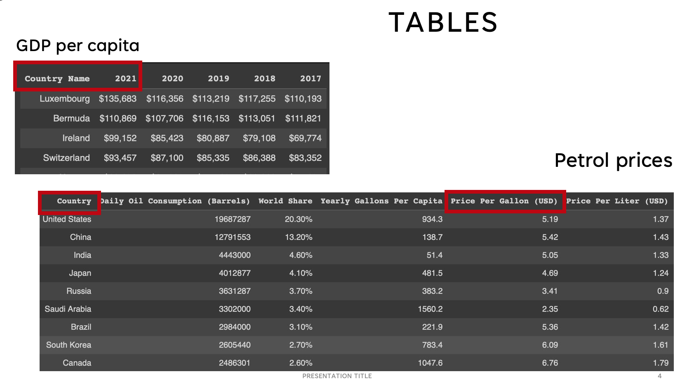
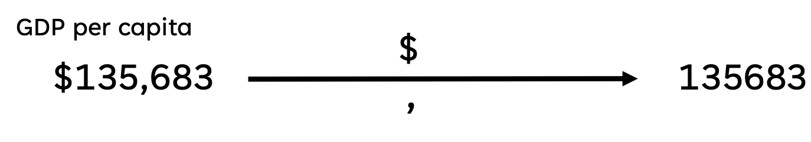
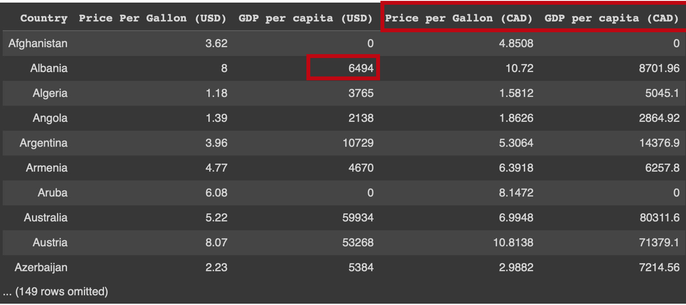
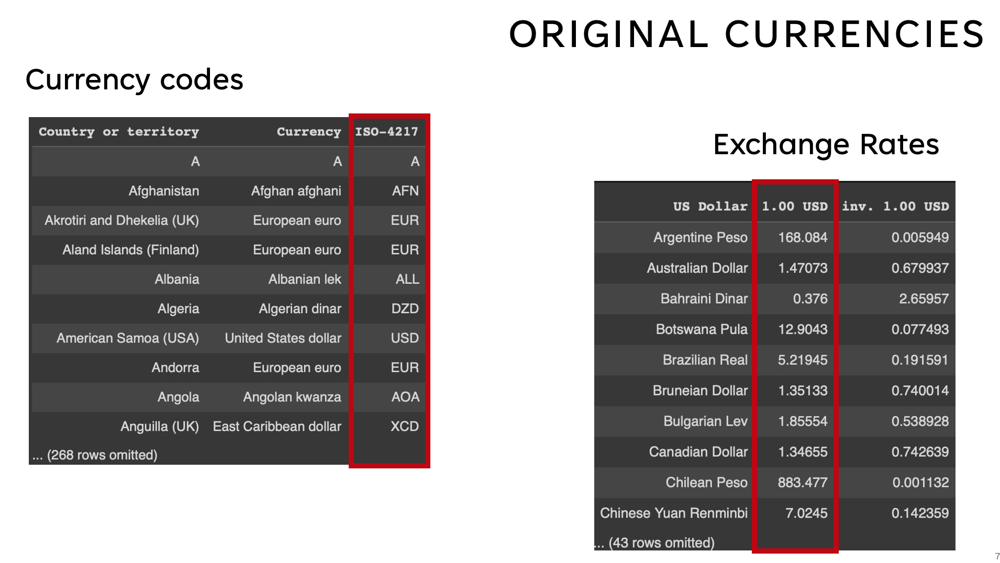
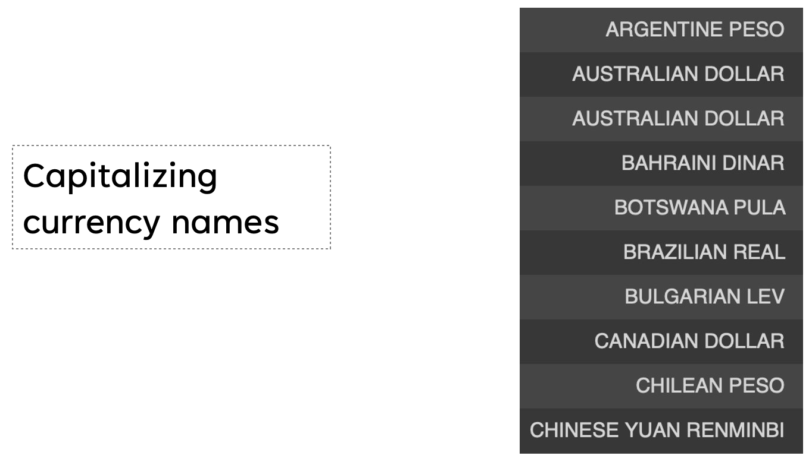
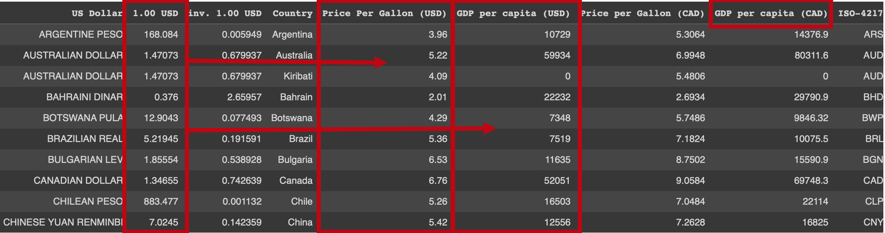
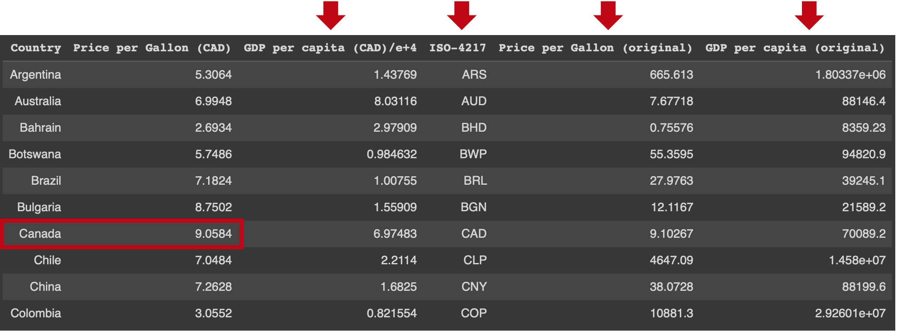
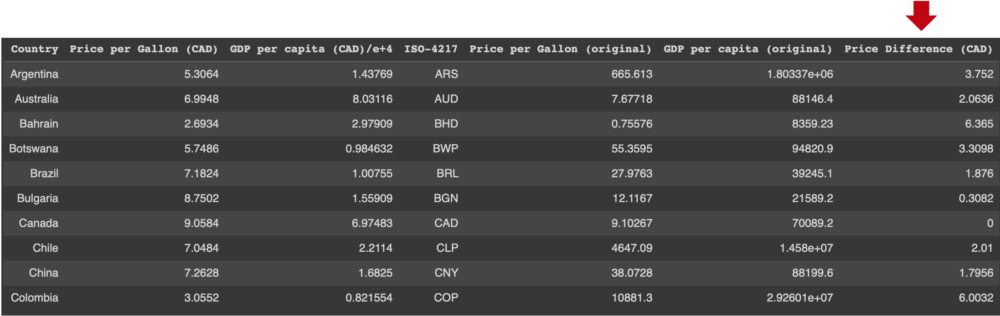
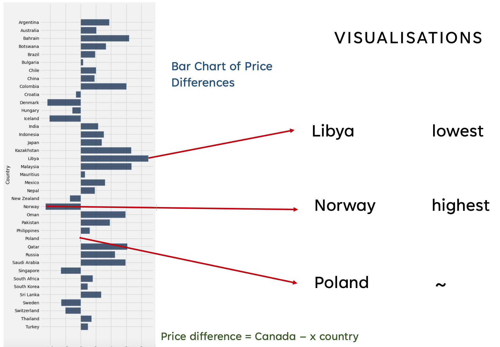
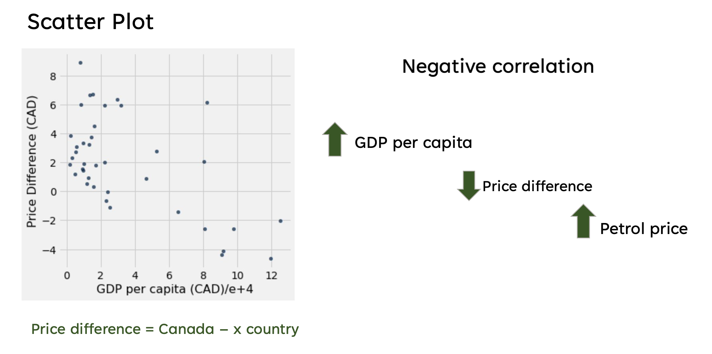

# Petrol / Gas Prices Index

## Introduction:

The purspose of this analysis is to look at the purchasing power parity (PPP) for petrol in a number of countries with respect to Canada. 

For those who don't know, PPP is :
> "the measurement of prices in different countries that uses the prices of specific goods to compare the absolute purchasing power of the countries' currencies, and, to some extent, their people's living standards" [(Wikipedia)](https://en.wikipedia.org/wiki/Purchasing_power_parity). 

## Why Petrol ?

Petrol or gas is one of the most basic needs for most people around the globe, because everyone needs vehicles for transportation. This analysis will compare petrol prices of various countries relative to Canada and test a possible factor that could explain the differences.

## Factor :

I chose GDP per capita (in simple terms - the "richness" of it's population ) as a possible factor because it's probably one of the first things that come to mind when thinking why a product's price may be different in different countries.

## Making the Index :

I will give a concise explanation of how I got my data and cleaned it before visualising and analysing it. You can see all the details on my [Jupyter notebook](https://colab.research.google.com/drive/1pWbJ-hhp8Sj6IHdxImYj2M9-1FZseAs2#scrollTo=fux1Fx7dKFll) 

### 1. Getting GDP per capita and petrol prices data :

First, I scraped the GDP per capita table from [Macrotrends](https://www.macrotrends.net/countries/ranking/gdp-per-capita) and imported the petrol prices dataset which I downloaded from [Kaggle](https://www.kaggle.com/datasets/zusmani/petrolgas-prices-worldwide). Then I joined them  based on the countries they had in common to form my "main" table. 

### 2. Cleaning the data :

I only kept the GDP per capita for 2021 and dropped the previous years' ones, since that was the most recent, and for the petrol prices, I only kept the price per gallon column, since the values were larger than the price per liter column, and it's easier on the eyes to visualise larger values than smaller decimals. 

The GDP per capita column had string values with "$" signs in front of the numbers and "," within the larger numbers, so I stripped the dollar signs from them, and converted them to integers after removing the commas. 

Since my values were in USD, I had to make a function to convert from USD to CAD based on an exchange rate from Google at that time, although I still kept the USD values for using in currency conversion later.

### 3. Getting the original currencies :

To display values in each country's own currency, I scraped currency symbol data from the [Countries of the World](https://www.countries-ofthe-world.com/world-currencies.html) website and joined it to my main table. 

Now, for converting currencies, I needed exchange rates, so I scraped an exchange rate table for USD from the [X-rates](https://www.x-rates.com/table/?from=USD&amount=1) website.

Then I tried to join my exchange rate table with the main table, but that wasn't happening because the currency names column had different capitalisations for the two tables, so I first turned all currency names to capital letters and joined the exchange rate table to the main one. 

Getting the original currencies now was easy, I multiplied the exchange rate column to the petrol price and GDP per capita columns. 

### 4. Cleaning the Final Table and Including Gas Price Differences :

I noticed some countries had a 0 GDP per capita and that was absurd so I removed such values to get a more meaningful table. I also dropped any irrelevant columns such as currency names (since I had a column dedicated to currency cides) and so on. And since my GDP per capita numbers had many zeroes in their values, I converted them to be in tens of thousands of dollars, so that my graphs would look more clean. 

Now that I had a table with gas prices and GDP per capita in both CAD and original currencies, all I needed to do was calculate gas price differences of each country relative to Canada. 

Finally, I subtracted each country's gas price per gallon in CAD from Canada's and added the price difference column to make the final version of my table.

## Visualisation :

I made two visualisations for my data:

* a **bar chart** to show the petrol price differences between Canada and other countries in my data using the *barh* method:

Some interesting observations from this chart is that Poland has a very similar petrol price per gallon to Canada while petrol prices are highest in Norway and lowest in Libya. 

* a **scatter plot** to see the correlation between GDP per capita and price differences using the *scatter* method:

At first glance, we see a negative correlation between the two variables.

# Analysis :

Finally, for finding the strength of the correlation, I caluclated the correlation coefficient for GDP per capita and price differences and got a value of about -0.598, which shows a moderately strong negative correlation.

So, gas prices seem to be higher in countries whith higher GDP per capita and vice versa. 

# Conclusion:

It seems countries with higher GDP per capita than Canada have higher petrol prices per gallon and vice versa. However, since this is a correlation study, where we haven't taken into account other variables such as global gas trade and world politics, taxes and other factors, we can't say higher GDP per capita leads to companies charging higher gas prices. There are many such variables to consider, but at least this is a start.

Interesting observations from the bar chart would be how colder countries in general have higher gas prices while warmer countries have lower, as we see with Norway having the highest petrol price per gallon and Libya, the lowest. 

I had a hard time figuring out how to remove the commas from my GDP per capita vlaues, but after several tries, I finally decided to split each value around the commas and concatenate the split parts.

Looking back, I could have used a live time exchange rate website for my USD to CAD conversion, like I did with my original currenies, to make my results more precise in the longer run. 

# Citations :

Wikipedia page : https://en.wikipedia.org/wiki/Purchasing_power_parity
GDP per capita data set : https://www.macrotrends.net/countries/ranking/gdp-per-capita
petrol dataset : https://www.kaggle.com/datasets/zusmani/petrolgas-prices-worldwide
currencies data set : https://www.countries-ofthe-world.com/world-currencies.html
exchange rate website : https://www.x-rates.com/table/?from=USD&amount=1

